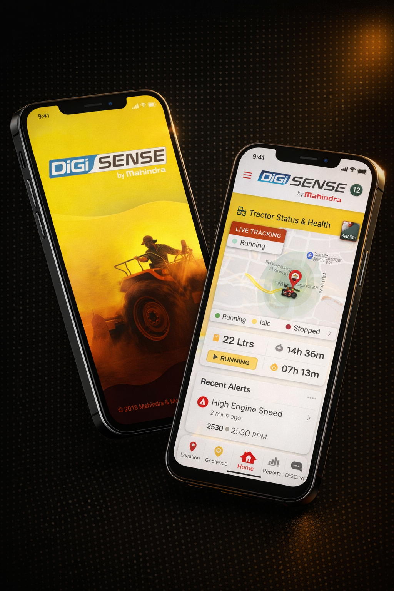

# Work Page — Implementation Spec
**Portfolio 2026 · Ameya Kulkarni**

---

## 1. Overview

A standalone `work.html` page that integrates with the existing SPA router. It follows every design pattern established in `index.html`, `digisense.html`, and `pfsone.html` — same CSS variables, same scroll-reveal system, same nav/footer injection via `components.js`.

**Sections (top to bottom):**
1. Page Header
2. Featured Project — DiGiSense (text-left / image-right)
3. Featured Project — PFS One (image-left / text-right)
4. Also Notable (3-column card grid)
5. Bottom CTA

---

## 2. File Structure

```
portfolio2026/
├── work.html               ← CREATE THIS
├── index.html              ← UPDATE: change Work nav link
├── router.js               ← UPDATE: add work route
├── components.js           ← UPDATE: mark Work as active when on work.html
├── style.css               ← UPDATE: add work page styles at end
├── digisense.html
├── pfsone.html
└── digisense_hero_image.png
```

---

## 3. Router Integration

### 3a. Add route to `router.js`

In the `routes` object (line 11), replace:
```js
'#work': { type: 'home', anchor: 'work' },
```
With:
```js
'#work': { type: 'work', file: 'work.html' },
```

Then add a new `work` route type handler in the `handleRoute` function:
```js
} else if (route.type === 'work') {
  await loadCaseStudy(route.file, hash); // reuses the same loader
}
```

> The existing `loadCaseStudy` function already handles fetching, style injection, and SPA transitions — no new logic needed. It strips nav/footer from the fetched file automatically (line 106).

### 3b. Update nav Work link

In `components.js`, change:
```html
<li><a href="#work">Work</a></li>
```
To:
```html
<li><a href="work.html">Work</a></li>
```
And in the mobile menu:
```html
<li><a href="#work" ...>...</a></li>
```
To:
```html
<li><a href="work.html" ...>...</a></li>
```

### 3c. Active nav state

In `work.html` (inside the `<script>` block at bottom), after the page loads, add:
```js
document.addEventListener('DOMContentLoaded', () => {
  const workLink = document.querySelector('a[href="work.html"], a[href="#work"]');
  if (workLink) workLink.classList.add('nav-active');
});
```

Add the `.nav-active` CSS rule in `style.css`:
```css
.nav-links a.nav-active {
  color: var(--accent);
}
.nav-links a.nav-active::after {
  transform: scaleX(1);
  background: var(--accent);
}
```

---

## 4. HTML Structure (`work.html`)

```html
<!DOCTYPE html>
<html lang="en">
<head>
  <meta charset="UTF-8">
  <meta name="viewport" content="width=device-width, initial-scale=1.0">
  <title>Work — Ameya Kulkarni</title>
  <link rel="preconnect" href="https://fonts.googleapis.com">
  <link rel="preconnect" href="https://fonts.gstatic.com" crossorigin>
  <link href="https://fonts.googleapis.com/css2?family=Cormorant+Garamond:ital,wght@0,300;0,400;1,300;1,400&family=DM+Sans:wght@300;400;500&display=swap" rel="stylesheet">
  <link rel="stylesheet" href="style.css">
</head>
<body>

  <!-- Nav + mobile menu injected by components.js -->

  <main class="work-page" id="work-view">

    <!-- ── SECTION 1: PAGE HEADER ── -->
    <section class="wp-header">
      <div class="wp-container">
        <div class="wp-header-content reveal">
          <div class="wp-eyebrow">
            <span class="wp-eyebrow-label">SELECTED WORK</span>
            <span class="wp-eyebrow-rule"></span>
          </div>
          <h1 class="wp-header-title">Work that ships.</h1>
          <p class="wp-header-sub">
            A curated selection of product design work across fintech, cybersecurity,
            IoT, and enterprise — each built with intent, each measured by outcome.
          </p>
        </div>
        <span class="wp-header-stat reveal">8 projects · 6 years</span>
      </div>
      <div class="wp-header-divider"></div>
    </section>


    <!-- ── SECTION 2: FEATURED PROJECT — DiGiSense ── -->
    <section class="wp-feature" id="feat-digisense">
      <div class="wp-container wp-feature-grid">

        <!-- Text Column -->
        <div class="wp-feature-text">
          <span class="wp-project-num reveal">01 /</span>
          <h2 class="wp-project-title reveal">DiGiSense</h2>
          <div class="wp-tags reveal">
            <span class="wp-tag">IoT</span>
            <span class="wp-tag">Connected Vehicles</span>
            <span class="wp-tag">UX Strategy</span>
          </div>
          <p class="wp-project-desc reveal">
            An IoT-powered connected vehicle platform enabling real-time fleet
            monitoring, predictive maintenance, and operational intelligence.
          </p>
          <div class="wp-metric reveal">
            <span class="wp-metric-num">35%</span>
            <span class="wp-metric-rule"></span>
            <span class="wp-metric-label">DOWNTIME REDUCTION</span>
          </div>
          <a href="#digisense" class="btn-secondary wp-cta reveal">View Case Study →</a>
        </div>

        <!-- Visual Column -->
        <div class="wp-feature-visual reveal">
          <div class="wp-visual-wrap">
            
          </div>
        </div>

      </div>
    </section>

    <div class="wp-section-divider"></div>


    <!-- ── SECTION 3: FEATURED PROJECT — PFS One ── -->
    <section class="wp-feature wp-feature--reverse" id="feat-pfsone">
      <div class="wp-container wp-feature-grid">

        <!-- Visual Column (left on desktop) -->
        <div class="wp-feature-visual reveal">
          <div class="wp-visual-wrap">
            <!-- Replace src with actual PFS One screenshot when available -->
            <div class="wp-visual-placeholder" aria-label="PFS One dashboard interface">
              <div class="wp-placeholder-inner"></div>
            </div>
          </div>
        </div>

        <!-- Text Column (right on desktop) -->
        <div class="wp-feature-text">
          <span class="wp-project-num reveal">02 /</span>
          <h2 class="wp-project-title reveal">PFS One</h2>
          <div class="wp-tags reveal">
            <span class="wp-tag">Cybersecurity</span>
            <span class="wp-tag">Risk Intelligence</span>
            <span class="wp-tag">SaaS Platform</span>
          </div>
          <p class="wp-project-desc reveal">
            A unified cybersecurity platform that helps organizations detect threats,
            assess risk, and respond faster with contextual intelligence.
          </p>
          <div class="wp-metric reveal">
            <span class="wp-metric-num">60%</span>
            <span class="wp-metric-rule"></span>
            <span class="wp-metric-label">FASTER THREAT DETECTION</span>
          </div>
          <a href="#pfsone" class="btn-secondary wp-cta reveal">View Case Study →</a>
        </div>

      </div>
    </section>

    <div class="wp-section-divider"></div>


    <!-- ── SECTION 4: ALSO NOTABLE ── -->
    <section class="wp-notable">
      <div class="wp-container">

        <div class="wp-notable-header reveal">
          <span class="wp-eyebrow-label">ALSO NOTABLE</span>
          <span class="wp-eyebrow-rule"></span>
        </div>

        <div class="wp-notable-grid">

          <div class="wp-notable-card reveal">
            <div class="wp-card-top">
              <h3 class="wp-card-title">Visitor Management System</h3>
              <span class="wp-card-arrow">↗</span>
            </div>
            <p class="wp-card-meta">Eptura (Formerly Condeco) · 2022</p>
            <div class="wp-tags wp-tags--sm">
              <span class="wp-tag">Enterprise UX</span>
              <span class="wp-tag">Dashboard</span>
              <span class="wp-tag">Operations</span>
            </div>
            <p class="wp-card-desc">
              Redesigning the visitor experience for enterprise facilities to improve
              security, efficiency, and operational visibility.
            </p>
          </div>

          <div class="wp-notable-card reveal">
            <div class="wp-card-top">
              <h3 class="wp-card-title">SMB Financial Platform</h3>
              <span class="wp-card-arrow">↗</span>
            </div>
            <p class="wp-card-meta">Biz Analyst · 2021</p>
            <div class="wp-tags wp-tags--sm">
              <span class="wp-tag">FinTech</span>
              <span class="wp-tag">SMB</span>
              <span class="wp-tag">Workflow Design</span>
            </div>
            <p class="wp-card-desc">
              A financial management platform for solo business owners to simplify
              invoicing, payments, and cashflow tracking.
            </p>
          </div>

          <div class="wp-notable-card reveal">
            <div class="wp-card-top">
              <h3 class="wp-card-title">Enterprise Marketplace</h3>
              <span class="wp-card-arrow">↗</span>
            </div>
            <p class="wp-card-meta">Siemens Ecosystem · 2020</p>
            <div class="wp-tags wp-tags--sm">
              <span class="wp-tag">Marketplace</span>
              <span class="wp-tag">Discovery</span>
              <span class="wp-tag">UX Strategy</span>
            </div>
            <p class="wp-card-desc">
              Enhancing product discovery and vendor engagement in a complex
              enterprise marketplace ecosystem.
            </p>
          </div>

        </div>
      </div>
    </section>


    <!-- ── SECTION 5: BOTTOM CTA ── -->
    <section class="wp-cta-section">
      <div class="wp-container wp-cta-inner reveal">
        <h2 class="wp-cta-heading">Have something to build?</h2>
        <p class="wp-cta-sub">I'm available for select projects in 2026.</p>
        <a href="#contact" class="btn-primary">Let's Talk →</a>
      </div>
    </section>

  </main>

  <script src="components.js"></script>
  <script src="router.js"></script>
  <script src="script.js"></script>
  <script>
    // Mark Work nav link as active
    document.addEventListener('DOMContentLoaded', () => {
      // Scroll reveal for this page (mirrors router.js reinitScripts logic)
      const reveals = document.querySelectorAll('.reveal');
      const observer = new IntersectionObserver((entries) => {
        entries.forEach(entry => {
          if (entry.isIntersecting) entry.target.classList.add('visible');
        });
      }, { threshold: 0.1, rootMargin: '0px 0px -40px 0px' });

      // Stagger grid children
      document.querySelectorAll('.wp-notable-grid, .wp-tags').forEach(grid => {
        grid.querySelectorAll('.reveal').forEach((el, i) => {
          el.style.transitionDelay = `${i * 0.08}s`;
        });
      });

      reveals.forEach(el => observer.observe(el));

      // Active nav state
      const workLinks = document.querySelectorAll('a[href="work.html"], a[href="#work"]');
      workLinks.forEach(l => l.classList.add('nav-active'));
    });
  </script>
</body>
</html>
```

---

## 5. CSS — Add to `style.css` (append at end)

```css
/* ════════════════════════════════════════════════
   WORK PAGE
   ════════════════════════════════════════════════ */

/* ── Shared container ── */
.wp-container {
  max-width: 1200px;
  margin: 0 auto;
  padding: 0 80px;
}

/* ── Eyebrow label + rule (reused in header + notable) ── */
.wp-eyebrow {
  display: flex;
  align-items: center;
  gap: 16px;
  margin-bottom: 20px;
}
.wp-eyebrow-label {
  font-family: var(--font-body);
  font-size: 10px;
  font-weight: 500;
  letter-spacing: 0.2em;
  color: var(--accent);
  text-transform: uppercase;
}
.wp-eyebrow-rule {
  display: block;
  width: 40px;
  height: 1px;
  background: var(--accent);
  flex-shrink: 0;
}

/* ── Section divider (hairline) ── */
.wp-section-divider {
  width: 80%;
  max-width: 1200px;
  margin: 0 auto;
  height: 1px;
  background: var(--border);
}

/* ── Tags ── */
.wp-tags {
  display: flex;
  flex-wrap: wrap;
  gap: 8px;
  margin-top: 20px;
}
.wp-tag {
  font-family: var(--font-body);
  font-size: 10px;
  font-weight: 500;
  letter-spacing: 0.12em;
  text-transform: uppercase;
  color: var(--accent);
  border: 1px solid rgba(200, 169, 126, 0.35);
  border-radius: 2px;
  padding: 4px 12px;
}
.wp-tags--sm .wp-tag {
  font-size: 9px;
  padding: 3px 10px;
}

/* ════════════════════════
   1. PAGE HEADER
   ════════════════════════ */
.wp-header {
  padding-top: calc(72px + 80px); /* nav height + breathing room */
  padding-bottom: 64px;
  position: relative;
}
.wp-header .wp-container {
  position: relative;
}
.wp-header-content {
  max-width: 640px;
}
.wp-header-title {
  font-family: var(--font-display);
  font-size: clamp(48px, 6vw, 80px);
  font-weight: 300;
  color: var(--text);
  line-height: 1.05;
  letter-spacing: -0.02em;
  margin-bottom: 20px;
}
.wp-header-sub {
  font-family: var(--font-body);
  font-size: 15px;
  color: var(--muted);
  line-height: 1.75;
  max-width: 480px;
}
.wp-header-stat {
  position: absolute;
  bottom: 0;
  right: 80px;
  font-family: var(--font-body);
  font-size: 12px;
  color: #555555;
  letter-spacing: 0.04em;
}
.wp-header-divider {
  width: 80%;
  max-width: 1200px;
  margin: 40px auto 0;
  height: 1px;
  background: var(--border);
}

/* ════════════════════════
   2 & 3. FEATURED PROJECTS
   ════════════════════════ */
.wp-feature {
  padding: 160px 0 180px;
}
.wp-feature-grid {
  display: grid;
  grid-template-columns: 45fr 55fr;
  gap: 80px;
  align-items: center;
}
/* Reversed layout (PFS One) */
.wp-feature--reverse .wp-feature-grid {
  grid-template-columns: 55fr 45fr;
}
.wp-feature--reverse .wp-feature-visual { order: -1; }

/* Text column */
.wp-feature-text {
  display: flex;
  flex-direction: column;
  align-items: flex-start;
}
.wp-project-num {
  font-family: var(--font-display);
  font-size: 14px;
  font-weight: 400;
  color: #555555;
  letter-spacing: 0.05em;
  margin-bottom: 8px;
}
.wp-project-title {
  font-family: var(--font-display);
  font-size: clamp(52px, 6vw, 88px);
  font-weight: 300;
  color: var(--text);
  line-height: 1.0;
  letter-spacing: -0.02em;
}
.wp-project-desc {
  font-family: var(--font-body);
  font-size: 15px;
  color: var(--muted);
  line-height: 1.75;
  max-width: 380px;
  margin-top: 20px;
}

/* Hero metric */
.wp-metric {
  margin-top: 40px;
  display: flex;
  flex-direction: column;
  align-items: flex-start;
  gap: 10px;
}
.wp-metric-num {
  font-family: var(--font-display);
  font-size: clamp(56px, 7vw, 96px);
  font-weight: 300;
  color: var(--accent);
  line-height: 1;
  letter-spacing: -0.02em;
}
.wp-metric-rule {
  display: block;
  width: 48px;
  height: 1px;
  background: var(--accent);
}
.wp-metric-label {
  font-family: var(--font-body);
  font-size: 11px;
  font-weight: 500;
  letter-spacing: 0.15em;
  text-transform: uppercase;
  color: #888888;
}

/* CTA button */
.wp-cta {
  margin-top: 36px;
}

/* Visual column */
.wp-feature-visual {
  width: 100%;
}
.wp-visual-wrap {
  position: relative;
  width: 100%;
  border-radius: 3px;
  overflow: visible;
}
.wp-visual-wrap::after {
  content: '';
  position: absolute;
  inset: 0;
  background: rgba(10, 10, 10, 0.12);
  border-radius: 3px;
  pointer-events: none;
}
.wp-visual-img {
  width: 100%;
  aspect-ratio: 16 / 10;
  object-fit: cover;
  border-radius: 3px;
  box-shadow: 0 32px 80px rgba(0, 0, 0, 0.6);
  display: block;
  transition: transform 0.6s ease;
  filter: brightness(0.9) saturate(0.85);
}
.wp-feature--reverse .wp-visual-img {
  filter: brightness(0.75) saturate(0.3) contrast(0.9);
}
.wp-visual-wrap:hover .wp-visual-img {
  transform: scale(1.015);
}

/* Placeholder for missing screenshots */
.wp-visual-placeholder {
  width: 100%;
  aspect-ratio: 16 / 10;
  border-radius: 3px;
  background: linear-gradient(135deg, #111 0%, #1a1a1a 60%, #141414 100%);
  box-shadow: 0 32px 80px rgba(0, 0, 0, 0.6), inset 0 0 80px rgba(200, 169, 126, 0.03);
  display: flex;
  align-items: center;
  justify-content: center;
  transition: transform 0.6s ease;
}
.wp-visual-wrap:hover .wp-visual-placeholder {
  transform: scale(1.015);
}
.wp-placeholder-inner {
  width: 60%;
  height: 60%;
  border: 1px solid rgba(200, 169, 126, 0.08);
  border-radius: 2px;
}

/* ════════════════════════
   4. ALSO NOTABLE
   ════════════════════════ */
.wp-notable {
  padding: 80px 0 120px;
}
.wp-notable-header {
  display: flex;
  align-items: center;
  gap: 16px;
  margin-bottom: 40px;
}
.wp-notable-grid {
  display: grid;
  grid-template-columns: repeat(3, 1fr);
  gap: 1px;
  background: var(--border);
  border: 1px solid var(--border);
  border-radius: 3px;
  overflow: hidden;
}
.wp-notable-card {
  background: var(--surface);
  padding: 32px 28px;
  transition: background 0.3s ease, border-color 0.3s ease;
  cursor: pointer;
  position: relative;
  border-left: 2px solid transparent;
  transition: background 0.3s ease, border-color 0.3s ease;
}
.wp-notable-card:hover {
  background: #141414;
  border-left-color: var(--accent);
}
.wp-card-top {
  display: flex;
  justify-content: space-between;
  align-items: flex-start;
  gap: 12px;
}
.wp-card-title {
  font-family: var(--font-display);
  font-size: 22px;
  font-weight: 400;
  color: var(--text);
  line-height: 1.2;
}
.wp-card-arrow {
  font-size: 16px;
  color: #555555;
  flex-shrink: 0;
  transition: color 0.3s ease;
  margin-top: 2px;
}
.wp-notable-card:hover .wp-card-arrow {
  color: var(--accent);
}
.wp-card-meta {
  font-family: var(--font-body);
  font-size: 11px;
  color: #666666;
  letter-spacing: 0.05em;
  margin-top: 8px;
}
/* Hidden description — reveals on hover */
.wp-card-desc {
  font-family: var(--font-body);
  font-size: 13px;
  color: #888888;
  line-height: 1.65;
  max-height: 0;
  opacity: 0;
  overflow: hidden;
  margin-top: 0;
  transition: max-height 0.35s ease, opacity 0.3s ease, margin-top 0.3s ease;
}
.wp-notable-card:hover .wp-card-desc {
  max-height: 80px;
  opacity: 1;
  margin-top: 16px;
}

/* ════════════════════════
   5. BOTTOM CTA
   ════════════════════════ */
.wp-cta-section {
  padding: 100px 0 120px;
  border-top: 1px solid var(--border);
}
.wp-cta-inner {
  display: flex;
  flex-direction: column;
  align-items: center;
  text-align: center;
  gap: 16px;
}
.wp-cta-heading {
  font-family: var(--font-display);
  font-size: clamp(36px, 4vw, 52px);
  font-weight: 300;
  color: var(--text);
  letter-spacing: -0.02em;
}
.wp-cta-sub {
  font-family: var(--font-body);
  font-size: 14px;
  color: #888888;
}
.wp-cta-section .btn-primary {
  margin-top: 8px;
}

/* ════════════════════════
   NAV ACTIVE STATE
   ════════════════════════ */
.nav-links a.nav-active {
  color: var(--accent);
}
.nav-links a.nav-active::after {
  transform: scaleX(1);
  background: var(--accent);
}
```

---

## 6. Responsive Behavior

### Breakpoint Summary

| Viewport    | Featured Layout         | Notable Grid | Padding  | Typography       |
|-------------|------------------------|--------------|----------|-----------------|
| > 1200px    | 2-col, text 45/image 55 | 3 columns    | 160/180px | Full clamp sizes |
| 1024–1200px | 2-col, slightly tighter | 3 columns    | 120/140px | Slight reduction |
| 768–1024px  | Stacked, image on top   | 2 columns    | 80/100px  | Medium clamp     |
| 480–768px   | Stacked, image on top   | 2 columns    | 60/80px   | Compressed       |
| < 480px     | Stacked, image on top   | 1 column     | 40/60px   | Min clamp values |

---

### CSS for Responsive (append after the work page CSS above)

```css
/* ── Laptop (1024px–1200px) ── */
@media (max-width: 1200px) {
  .wp-container { padding: 0 56px; }
  .wp-header-stat { right: 56px; }
  .wp-feature { padding: 120px 0 140px; }
  .wp-feature-grid { gap: 56px; }
}

/* ── Tablet (768px–1024px): Stack featured projects ── */
@media (max-width: 1024px) {
  .wp-container { padding: 0 40px; }
  .wp-header-stat { right: 40px; }

  /* Both featured projects: single column, image on top */
  .wp-feature { padding: 80px 0 100px; }
  .wp-feature-grid {
    grid-template-columns: 1fr;
    gap: 48px;
  }
  /* On reverse layout (PFS One), reset visual order so image stays on top */
  .wp-feature--reverse .wp-feature-grid { grid-template-columns: 1fr; }
  .wp-feature--reverse .wp-feature-visual { order: 0; }

  /* Image: full width, taller aspect on tablet */
  .wp-visual-img,
  .wp-visual-placeholder {
    aspect-ratio: 16 / 9;
  }

  .wp-project-title { font-size: clamp(44px, 8vw, 72px); }
  .wp-metric-num { font-size: clamp(48px, 10vw, 80px); }

  /* Notable: 2 columns */
  .wp-notable-grid { grid-template-columns: repeat(2, 1fr); }

  /* The third card spans full width to avoid orphan */
  .wp-notable-card:last-child {
    grid-column: 1 / -1;
  }
}

/* ── Mobile (480px–768px) ── */
@media (max-width: 768px) {
  .wp-container { padding: 0 24px; }

  .wp-header { padding-top: calc(72px + 48px); padding-bottom: 48px; }
  .wp-header-stat {
    position: static;
    display: block;
    margin-top: 24px;
    text-align: left;
  }
  .wp-header-title { font-size: clamp(40px, 10vw, 64px); }

  .wp-feature { padding: 64px 0 80px; }
  .wp-feature-grid { gap: 36px; }

  .wp-project-title { font-size: clamp(40px, 10vw, 64px); }
  .wp-metric-num { font-size: clamp(44px, 12vw, 72px); }

  /* Notable: 2 columns (still readable at 768px) */
  .wp-notable-grid { grid-template-columns: repeat(2, 1fr); }
  .wp-notable-card:last-child { grid-column: 1 / -1; }

  /* On mobile, always show card description (no hover) */
  .wp-card-desc {
    max-height: 80px;
    opacity: 1;
    margin-top: 16px;
  }

  .wp-notable { padding: 60px 0 80px; }
  .wp-cta-section { padding: 72px 0 88px; }
}

/* ── Small mobile (< 480px) ── */
@media (max-width: 480px) {
  .wp-container { padding: 0 20px; }

  .wp-header { padding-top: calc(72px + 32px); }
  .wp-header-title { font-size: clamp(36px, 10vw, 52px); }
  .wp-header-sub { font-size: 14px; }

  .wp-feature { padding: 48px 0 64px; }
  .wp-feature-grid { gap: 28px; }

  .wp-project-title { font-size: clamp(36px, 12vw, 56px); }
  .wp-metric-num { font-size: clamp(40px, 14vw, 64px); }

  /* Tags wrap fine — no changes needed */

  /* Notable: 1 column */
  .wp-notable-grid {
    grid-template-columns: 1fr;
    background: none;
    border: none;
    gap: 12px;
  }
  .wp-notable-card {
    border: 1px solid var(--border);
    border-radius: 3px;
  }
  .wp-notable-card:last-child { grid-column: auto; }

  .wp-cta-heading { font-size: clamp(28px, 8vw, 40px); }

  /* CTA button full width on small screens */
  .wp-cta-section .btn-primary {
    width: 100%;
    text-align: center;
    justify-content: center;
  }
}
```

---

## 7. Mobile-Specific Behavior Notes

### Layout Changes on Mobile

| Element | Desktop | Mobile (< 768px) |
|---|---|---|
| Featured project layout | Side-by-side, alternating | Always stacked — image on top, text below |
| Image aspect ratio | 16:10 | 16:9 |
| Alternating reverse (PFS One) | Image on left | Image on top (same as DiGiSense) |
| Header stat (`8 projects · 6 years`) | Absolute, bottom-right | Static, flows below subline |
| Notable card descriptions | Hidden, hover-reveal | Always visible |
| Notable grid | 3 columns | 2 columns (480px+), 1 column (< 480px) |
| CTA button | Auto width | Full width (< 480px) |

### Touch & Tap Considerations

- All buttons (`btn-primary`, `btn-secondary`, `.wp-cta`) must be minimum **44px tall** — verify the existing `btn-primary`/`btn-secondary` padding satisfies this
- `.wp-notable-card` tap area is the full card — ensure no nested links conflict
- Image hover effect (`scale(1.015)`) uses `transition` not JS — works fine on mobile (no hover state, image stays static which is correct)
- The mobile menu (injected by `components.js`) already handles Work link correctly once you update `href="work.html"`

### Scroll Animations on Mobile

The IntersectionObserver scroll reveals work on mobile without changes. One consideration: on very small screens, reduce the `rootMargin` offset or the `transitionDelay` stagger if elements feel slow to appear when scrolling fast.

---

## 8. JavaScript Behavior Summary

All interactive behaviors are CSS-driven or use existing patterns — no new JS files needed.

| Behavior | Mechanism |
|---|---|
| Scroll reveal on all `.reveal` elements | IntersectionObserver in inline `<script>` (mirrors `router.js reinitScripts`) |
| Stagger delay on grid children | `transitionDelay` set via JS loop in inline script |
| Notable card description hover-reveal | Pure CSS `max-height` + `opacity` transition |
| Active nav state | Inline script adds `.nav-active` class on `DOMContentLoaded` |
| Case study navigation (View Case Study →) | Links to `#digisense` / `#pfsone` — existing router handles these |
| Bottom CTA (Let's Talk →) | Links to `#contact` — existing router scrolls to contact section |
| Image hover scale | Pure CSS `transform: scale(1.015)` on `.wp-visual-wrap:hover` |

---

## 9. Image Handling

### DiGiSense
- File: `digisense_hero_image.png` (exists in repo)
- CSS treatment: `filter: brightness(0.9) saturate(0.85)` — keeps natural warmth, slight dim
- No placeholder needed

### PFS One
- **If screenshot is available:** Replace the `.wp-visual-placeholder` div with an `` tag. Add `filter: brightness(0.75) saturate(0.3) contrast(0.9)` in `.wp-feature--reverse .wp-visual-img`
- **If no screenshot yet:** The `.wp-visual-placeholder` renders a dark gradient panel with subtle gold inner shadow — keeps the layout intact without stock photos

---

## 10. Checklist — Pre-Ship Testing

### Desktop (1440px)
- [ ] Page loads, nav injects, Work link is gold/active
- [ ] Header: eyebrow label + gold rule + heading + subline + stat visible
- [ ] DiGiSense: text-left / image-right, image atmospheric, no container box
- [ ] PFS One: image-left / text-right (reversed), image desaturated
- [ ] `35%` and `60%` metrics in gold with underline rule and label
- [ ] Both "View Case Study →" buttons link correctly to case studies
- [ ] Also Notable: 3 cards visible, descriptions hidden
- [ ] Hover a Notable card: description slides in, left border turns gold
- [ ] Bottom CTA: heading + subline + Let's Talk button

### Tablet (768px–1024px)
- [ ] Both featured projects stack vertically (image top, text bottom)
- [ ] PFS One image is also on top (order reset)
- [ ] Notable grid is 2-column, third card spans full width
- [ ] Separator lines still visible and centered
- [ ] No horizontal overflow

### Mobile (< 768px)
- [ ] All featured sections stack correctly
- [ ] Header stat flows below subline (not absolute positioned)
- [ ] Notable card descriptions are **always visible** (no hover needed)
- [ ] Images render at 16:9 ratio without clipping content
- [ ] Nav hamburger works, Work link in mobile menu points to `work.html`

### Small Mobile (< 480px)
- [ ] Notable grid is 1 column
- [ ] CTA button is full width
- [ ] Typography is readable (no text smaller than 13px)
- [ ] No elements overflow the viewport horizontally

### SPA Integration
- [ ] Clicking Work in nav routes to work page via router (no full page reload)
- [ ] Back-navigating to Home transitions smoothly
- [ ] Clicking "View Case Study →" loads DiGiSense/PFS One correctly
- [ ] "Let's Talk →" scrolls to contact section on the home page

---

## 11. Quick Reference — CSS Class Map

| Class | Purpose |
|---|---|
| `.work-page` | Root wrapper for page |
| `.wp-container` | Max-width centering wrapper |
| `.wp-header` | Page header section |
| `.wp-eyebrow` / `.wp-eyebrow-label` / `.wp-eyebrow-rule` | Gold label + horizontal rule |
| `.wp-feature` | Featured project section |
| `.wp-feature--reverse` | Flips column order for PFS One |
| `.wp-feature-grid` | CSS Grid wrapper (2-col desktop) |
| `.wp-feature-text` | Text column |
| `.wp-feature-visual` | Image column |
| `.wp-visual-wrap` | Image wrapper with hover + overlay |
| `.wp-visual-img` | Actual `` element |
| `.wp-visual-placeholder` | Dark gradient fallback when no image |
| `.wp-project-num` | `01 /` counter |
| `.wp-project-title` | Large serif project name |
| `.wp-tags` / `.wp-tag` | Tag pill group |
| `.wp-tags--sm` | Smaller tags (Notable cards) |
| `.wp-project-desc` | Short description paragraph |
| `.wp-metric` | Metric block (number + rule + label) |
| `.wp-metric-num` | Large gold number |
| `.wp-metric-rule` | 48px gold horizontal line |
| `.wp-metric-label` | Uppercase muted label |
| `.wp-cta` | "View Case Study →" button |
| `.wp-section-divider` | Hairline 1px rule between sections |
| `.wp-notable` | Also Notable section |
| `.wp-notable-grid` | 3-column card grid |
| `.wp-notable-card` | Individual notable project card |
| `.wp-card-top` | Title + arrow row |
| `.wp-card-title` | Card project name |
| `.wp-card-arrow` | `↗` arrow |
| `.wp-card-meta` | Client · Year |
| `.wp-card-desc` | Hidden description (hover-reveal) |
| `.wp-cta-section` | Bottom CTA section |
| `.wp-cta-heading` | "Have something to build?" |
| `.wp-cta-sub` | Availability subline |
| `.nav-active` | Active nav link gold state |
